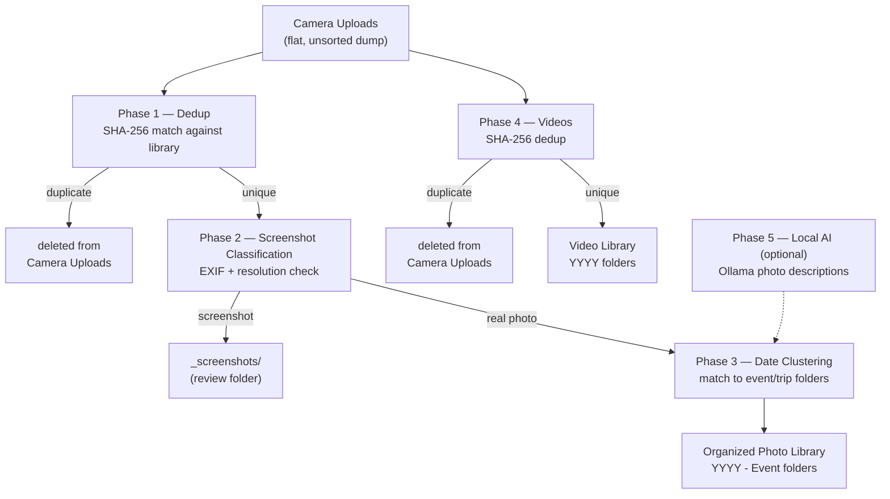

# photo-library-organizer

> **⚠️ WARNING: This tool permanently deletes files.** Once your camera uploads are organized into your photo library, the generated scripts delete the original files from your camera uploads folder. **Read this entire README — especially the [Safety model](#safety-model) and [Disclaimer](#disclaimer) sections — before running anything.** Always use `--dry-run` first, confirm your cloud backups are working, and do not skip the review steps.

A Claude skill that organizes a flat camera uploads dump — a single folder containing multiple years of photos, videos, and screenshots all mixed together — into a structured photo library with event and trip subfolders.

It works by generating Python and bash scripts tailored to **your specific folder structure**, running them phase by phase with your review at each step.

## Is this for you?

**Use this skill if:**
- You have a year or more of photos dumped flat in one camera uploads folder, with no structure
- You already have an organized photo library (by year, by event, or both) to sort into — this skill matches *into* an existing structure, it doesn't invent one from nothing
- You're comfortable running Python/bash scripts from Terminal and reviewing their output between steps

**Skip it if:**
- You don't have an existing organized library yet — start by creating a rough year-folder structure first
- Your camera uploads folder has well under 100 photos — manual organization is probably faster
- You'd rather use a dedicated photo-management app (Apple Photos, Google Photos) with its own built-in organization

## What it does

Claude guides you through five phases:

| Phase | What happens |
|-------|-------------|
| **1 — Dedup** | SHA-256 fingerprints every file in your organized library and camera uploads. Generates a delete script for camera uploads files already in your library. |
| **2 — Screenshot classification** | Uses `exiftool` to check EXIF camera fields (FNumber, ISO, ExposureTime). Real photos have them; screenshots don't. Also cross-checks known phone screen resolutions. Moves screenshots to a `_screenshots/` review folder. |
| **3 — Date clustering** | Groups remaining real photos into date-proximity clusters (default: 3-day gap). Matches each cluster to your existing event/trip folders by date overlap, then by event keywords. Catch-all: a `{YEAR} - Misc` folder. |
| **4 — Videos** | SHA-256 deduplicates camera uploads videos against your video library (read-only). Copies unique videos to `{video_library}/{YYYY}/`. Generates a verified delete script for originals. |
| **5 — Local AI (optional)** | Runs [moondream](https://ollama.com) locally via Ollama to describe each photo. Used as a secondary signal for better cluster-to-folder matching. No photos leave your machine. |

Every destructive step uses a **two-pass safety model**: verify all destination copies exist and SHA-256-match the originals → only then delete. Every script has `--dry-run` mode.

### Phase flow



### Before / after

```
Before — camera_uploads/ (flat, years all mixed together)
├── IMG_4821.jpg
├── IMG_4822.jpg
├── IMG_4901.jpg
├── 2023-04-12 14.32.01.png        ← screenshot, not a photo
├── VID_0043.mov
├── IMG_5823.jpg                   ← duplicate, already in your library
├── IMG_6012.heic
├── 2022-11-24 09.15.33.jpg
├── IMG_7311.jpg
└── ... thousands more, no structure

After — organized into your existing library layout
Photo Library/
├── 2021 - Kona, Big Island, Hawaii/
│   └── IMG_5823.jpg, IMG_5824.jpg, ...
├── 2022 - Thanksgiving/
│   └── IMG_6012.heic, ...
├── 2023 - Misc/
│   └── IMG_4821.jpg, IMG_4901.jpg, ...
└── _screenshots/
    └── 2023-04-12 14.32.01.png     ← moved here for your review, not deleted

Video Library/
└── 2023/
    └── VID_0043.mov
```

## Prerequisites

**This skill is built for and tested on macOS.** The generated scripts include Linux-specific command variants (e.g. `sha256sum` instead of `shasum -a 256`) as a best-effort accommodation, but that path has not been run or verified on Linux. If you're on Linux, treat it as unsupported — review every generated script carefully before running it, and expect to fix issues yourself.

```bash
# Required
brew install exiftool          # EXIF metadata reader
python3 --version              # Python 3.8+
```

**Disk space**: scripts copy files into your library and verify the copies *before* deleting originals, so you temporarily need roughly **2–2.5× the size of your camera uploads folder** free on the destination drive.

### Optional: local AI classification (Phase 5)

Phase 5 is entirely optional — skip it if you'd rather not install anything extra. Date clustering (Phase 3) works well on its own; local AI just gives Claude an extra signal (a one-sentence description of each photo) to better match ambiguous clusters to the right event folder.

If you do want it, here's what the two pieces are:

- **[Ollama](https://ollama.com)** is a free app that runs AI models directly on your Mac, instead of sending anything to a server. Think of it as a local engine for running models — by itself it doesn't do anything until you tell it which model to run.
- **moondream** is the specific model this skill uses with Ollama: a small (~1.8 GB) vision-language model that can look at a photo and describe what's in it in a sentence (e.g. "two people hiking on a mountain trail"). It runs entirely on your machine — no photos are uploaded anywhere.

**Setup (one-time):**

1. Download and install the Ollama app from [ollama.com](https://ollama.com) — it installs like any other Mac app (drag to Applications).
2. Open Terminal and download the moondream model. This pulls ~1.8 GB, so it may take a few minutes depending on your connection:
   ```bash
   ollama pull moondream
   ```
3. Install the Python package Claude's generated scripts use to talk to Ollama:
   ```bash
   pip3 install ollama
   ```

That's it — Ollama runs quietly in the background afterward, and you won't need to repeat this setup for future runs.

## Installation

### Claude (web / desktop — Cowork)

1. Download `photo-library-organizer.skill` from [Releases](https://github.com/mikhaelf/photo-library-organizer/releases)
2. Double-click the file — Claude opens and shows the install prompt
3. Click **Add to library**

The skill is now available in any Claude chat. Trigger it by describing your problem ("I have a messy camera uploads folder I need to organize") or by typing `/photo-library-organizer`. On first use, it asks where your folders are — nothing runs until you answer.

## Usage

When you invoke the skill, Claude asks five questions:

1. Path to your **camera uploads dump** (the flat, messy source folder)
2. Path to your **organized photo library** (has year/event subfolders)
3. Path to your **video library** (optional)
4. Your OS: **macOS** (recommended and tested) or **Linux** (untested — see [Prerequisites](#prerequisites))
5. Whether you want local AI classification via **Ollama** (optional)

**Example**: say you have 3,500 photos in `~/Downloads/camera_uploads`, an organized library at `~/Pictures/Photo Library`, and some home videos mixed in with the photos but no separate video library yet. You'd answer: the camera uploads path, the library path, leave video library blank (Phase 4 asks if it finds videos), your OS, and whether you want Ollama. Claude then generates and walks you through each phase in order, starting with dedup.

Claude then generates scripts one phase at a time, and the next section walks through what running each phase actually looks like.

## How the workflow works

This skill runs in a back-and-forth rhythm between Claude and your Terminal. Claude generates a script → you run it → you report the result back → Claude generates the next step.

**What to do after each script runs:**

- **Success** — paste the last few lines of Terminal output into Claude (e.g. `Done: 1432 deleted  2 already gone  0 errors`) and Claude will confirm and generate the next script.
- **Nothing to do** — type "done" or "0 duplicates found" and Claude moves to the next phase.
- **Error** — paste the full error message into Claude. Don't try to diagnose it yourself; Claude will fix the script and give you a corrected version to re-run.

**Reviewing report files before running delete scripts:**

Every phase that moves or deletes files first generates a human-readable report. Always open and spot-check it before proceeding. Scripts are saved to `{photo_library}/_photo_org_scripts/` — for example if your library is at `~/Photos/Library`:

```bash
open ~/Photos/Library/_photo_org_scripts/dupes_report.txt
open ~/Photos/Library/_photo_org_scripts/likely_screenshots.txt
open ~/Photos/Library/_photo_org_scripts/clusters_report.txt
```

If something looks wrong — a file routed to the wrong folder, a real photo misclassified as a screenshot — tell Claude before running the next script. Claude will adjust the assignment and regenerate.

## Phase-by-phase walkthrough

> **Note:** Example paths below use `~/Photos/Library` as a placeholder for your photo library. Substitute the actual path Claude generated scripts for.
>
> **Skip Phase 4** if your camera uploads folder has no video files. **Skip Phase 5** if your library's folder names already make event matching straightforward (e.g. "Kona 2021", "Thanksgiving 2022") — date clustering alone (Phase 3) handles that well without AI.

### Phase 1 — Setup

Claude asks five questions, all at once. Answer them and Claude generates `find_dupes.py` immediately.

### Phase 1 — Deduplication

```bash
python3 ~/Photos/Library/_photo_org_scripts/find_dupes.py
```
Runtime: 1–10 minutes depending on library size.

When done, open `dupes_report.txt` and spot-check a few entries. Then:

```bash
bash ~/Photos/Library/_photo_org_scripts/delete_dupes.sh --dry-run
# Review the list, then:
bash ~/Photos/Library/_photo_org_scripts/delete_dupes.sh --delete
```

Paste the final output line into Claude (`Done: X deleted  Y already gone  Z errors`).

### Phase 2 — Screenshot classification

```bash
python3 ~/Photos/Library/_photo_org_scripts/classify_files.py
```
Runtime: usually under a minute — exiftool reads metadata fast even across thousands of files.

Open `likely_screenshots.txt` and sample a few entries to confirm they're actually screenshots (not small real photos). Then:

```bash
bash ~/Photos/Library/_photo_org_scripts/move_screenshots.sh --dry-run
# Review, then:
bash ~/Photos/Library/_photo_org_scripts/move_screenshots.sh --move
```

Paste the result back (`Done: X moved  Y skipped`). Screenshots go to `_screenshots/` — not deleted, so you can review them later.

### Phase 3 — Date clustering

```bash
# Without Ollama:
python3 ~/Photos/Library/_photo_org_scripts/cluster_photos.py

# With Ollama (moondream) for richer matching:
python3 ~/Photos/Library/_photo_org_scripts/cluster_photos.py --ollama
```
Runtime: a few minutes without `--ollama`; with it, add a few seconds per photo, since moondream describes each one individually.

Open `clusters_report.txt`. Each cluster shows the destination folder and why it was chosen (date match, keyword, or catch-all). If any assignment looks wrong, tell Claude which file and where it should go — Claude will adjust the copy script before you run it.

```bash
bash ~/Photos/Library/_photo_org_scripts/copy_clusters.sh --dry-run
# Review, then:
bash ~/Photos/Library/_photo_org_scripts/copy_clusters.sh --copy
```

When copy succeeds, generate and run the delete script:

```bash
python3 ~/Photos/Library/_photo_org_scripts/gen_delete_clusters.py
bash ~/Photos/Library/_photo_org_scripts/delete_clusters.sh
```

### Phase 4 — Videos (if applicable)

Claude generates this phase automatically if you provided a video library path or if camera uploads contains video files.

Runtime: similar shape to Phase 1, but per-file slower — videos are much larger than photos, so hashing takes longer per file even though there are usually far fewer of them.

```bash
python3 ~/Photos/Library/_photo_org_scripts/check_video_dupes.py
bash ~/Photos/Library/_photo_org_scripts/delete_video_dupes.sh        # remove cam upload dupes
bash ~/Photos/Library/_photo_org_scripts/copy_unique_videos.sh --dry-run
bash ~/Photos/Library/_photo_org_scripts/copy_unique_videos.sh --copy
python3 ~/Photos/Library/_photo_org_scripts/gen_delete_unique_videos.py
bash ~/Photos/Library/_photo_org_scripts/delete_unique_videos.sh
```

**Your video library is never modified** — the skill only copies into it and only deletes from camera uploads.

## Troubleshooting

**`exiftool: command not found`**
→ `brew install exiftool` (see [Prerequisites](#prerequisites))

**`python3: command not found`, or a version below 3.8**
→ Install or update Python from [python.org](https://python.org), or `brew install python3`

**"Permission denied" on a folder**
→ Check you actually own it: `ls -ld /path/to/folder`. If it's owned by another user, or on a drive mounted read-only, fix that before continuing — the scripts can't work around it.

**A script seems hung with no output**
→ Phase 1 and Phase 4 print progress every 1000 files / 10 videos. If you've waited a while with zero progress lines, check free disk space (`df -h`) and that the source/destination drives are actually mounted and responsive.

**Something in a report looks wrong** — a duplicate that isn't really a duplicate, a real photo flagged as a screenshot, a cluster routed to the wrong folder
→ Don't run the next script. Tell Claude what looks wrong and which file; Claude will adjust the assignment and regenerate before you proceed.

**A generated script throws an error**
→ Paste the full error message (not just the last line) into Claude. Don't try to fix generated scripts yourself — Claude wrote them and can correct and regenerate faster than a manual patch.

## Safety model

All generated delete scripts follow this pattern — no exceptions:

```
Pass 1: Verify EVERY destination copy exists + SHA-256 matches the source
        → Any failure: print all failures, ABORT, exit 1. Nothing is deleted.

Pass 2: Only runs if Pass 1 fully passed
        → Delete all originals
```

If you have cloud sync or a backup solution (iCloud, Google Photos, Time Machine, etc.), that's an additional recovery layer — but don't rely on it as the only safety net. The skill notes this at the bottom of every delete script, without assuming any specific provider.

The organized library and video library are **never modified** — only the camera uploads folder has files deleted from it.

## Example output

After Phase 1 (dedup), Claude generates `dupes_report.txt`:

```
Duplicate Report — Camera Uploads vs. Photo Library
======================================================================

Total duplicates: 1,432

  2021 - Kona, Big Island, Hawaii  (47 files)
    IMG_5823.jpg  ->  2021 - Kona, Big Island, Hawaii/IMG_5823.jpg
    IMG_5824.jpg  ->  2021 - Kona, Big Island, Hawaii/IMG_5824.jpg
    ...

  2022 - Thanksgiving  (23 files)
    ...
```

After Phase 2 (screenshot classification), Claude generates `likely_screenshots.txt` with a confidence reason per file:

```
Likely Screenshots — 1,057 files
  Screen resolution match: 412
  No camera EXIF (other):  645
  
  2023-04-12 14.32.01.png   (1179x2556)  [screen resolution match]
  2023-04-12 14.35.44.png   (1179x2556)  [screen resolution match]
  2022-11-30 09.11.22.jpg   (800x600)    [no camera EXIF]
  ...
```

**What to look for**: in `dupes_report.txt`, confirm the destination paths actually point inside your current library — not an old backup or an unrelated folder you don't recognize. In `likely_screenshots.txt`, spot-check the "no camera EXIF" entries specifically — that's the lower-confidence bucket, and it's where a real photo is most likely to get misclassified.

## How clusters are matched to folders

For each date cluster, the skill scores your existing event folders:

1. **Date overlap** — count of dates shared between the cluster's range and the folder's photo dates (+1 per shared date). This is the primary signal.
2. **AI description tokens** (if Ollama is enabled) — shared meaningful words between the moondream descriptions and the folder name (+2 per token).
3. **Event keywords** — secular holidays and life events: `birthday`, `wedding`, `graduation`, `halloween`, `thanksgiving`, `new year`, `fourth of july`, `beach`, `hiking`, `ski`, `concert`, `baby`, `photoshoot`, and others.
4. **Seasonal heuristics** — Oct 15–Nov 5 → Halloween; Nov 20–Dec 5 → Thanksgiving; Dec 26–Jan 3 → New Year.
5. **Catch-all** — `{YEAR} - Misc` (or any folder matching `{YEAR}.*misc`, `{YEAR}.*travels`, `{YEAR}.*unsorted` in your library).

## Disclaimer

This skill generates scripts that **permanently delete files**. Always run `--dry-run` first and review the output. Verify your cloud sync is working before running any delete script. This tool is provided as-is; the author is not responsible for data loss. Always keep backups.

Generated scripts use SHA-256 verification as a safety measure. For extremely valuable photos, use additional backups before proceeding.[^1]

[^1]: **Why SHA-256 and not MD5?** This skill originally used MD5, on the reasoning that the threat model is *accidental* duplication — "did Dropbox upload a second copy of this vacation photo?" — not an adversary deliberately crafting colliding files, and that MD5's speed advantage would matter when hashing 10,000+ files in a single pass. A benchmark against real photo files changed that conclusion: on modern hardware (Apple M-series, and x86 CPUs with SHA extensions), SHA-256 hashed the same files only ~30% slower than MD5 — a gap that was much wider a decade ago, before hardware SHA acceleration was standard. And that 30% barely matters in practice, because the actual bottleneck is disk I/O, not the hash function: reading a 3–8 MB JPEG off an SSD dominates the time far more than hashing it does, so this workload is I/O-bound, not CPU-bound. With the performance case for MD5 largely gone, there's no reason to keep the weaker algorithm — SHA-256 is built into both macOS (`shasum -a 256`) and Linux (`sha256sum`) with no extra dependencies, so the switch cost nothing but a find-and-replace.

## License

MIT — see [LICENSE](LICENSE).
